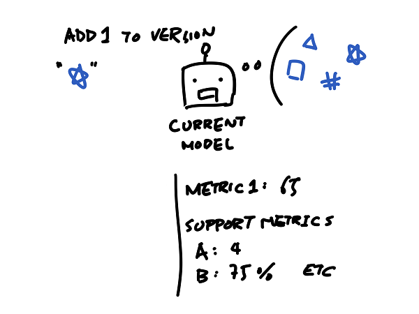

The ideal pipeline for me is one that minimizes the time I spend in 2 and 3 this cycle

1. code a feature/build a new model based on a new idea
2. test the feature/model 
3. record the metrics and compare to current model with current features

Say, if there's a model with a bunch of features, and I have a metric that I want to optimize. There are also other supporting metrics that I'm interested in.

Then I write some code to create some new features to be tested.

After I created the feature with some code, this process of "creating feature" is fed into the bot and the bot will test this feature by comparing scores of the possible models --- not just the model which is my baseline but a set of potential models --- with and without this new feature. 

The score is then compared to current baseline.

If the score bump is better than a predefined number, then I know I want to keep it and investigate more, so the bot will keep it in there for me along with the metric logs.

The code I should spend the most time on should be the part where I think about how to make new features or use the features in a different way to spin up a model.